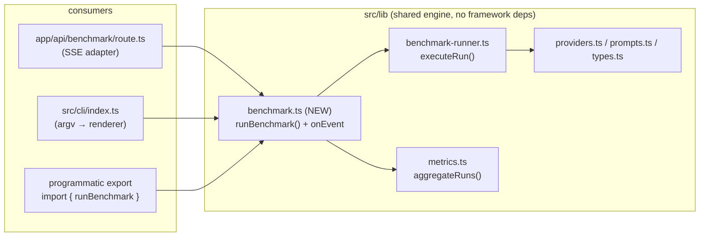
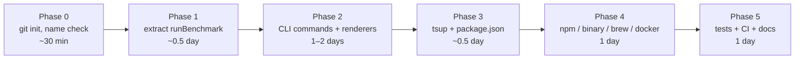

# Plan: Ship `model-bench` as an installable CLI

## 1. Goal

Take the existing Next.js benchmark tool (`app/page.tsx` + `app/api/benchmark/route.ts` + `src/lib/*`)
and expose the exact same benchmarking engine as a **first-class CLI** that users can install and run:

```bash
# one-off, no install
npx model-bench run --provider openai --model gpt-4o-mini --runs 8

# global install
npm i -g model-bench
model-bench run --endpoint http://localhost:11434/v1 --model llama3.2 --json

# installable standalone binary (no Node required)
brew install <you>/tap/model-bench
```

The web UI must keep working unchanged — the CLI and the API route share **one** engine.

---

## 2. Current state (what we already have)

| Piece | File | Reusable as-is? |
| --- | --- | --- |
| Per-run HTTP + SSE streaming engine | [benchmark-runner.ts](file:///e:/AI%20Projects/AIModelTest/src/lib/benchmark-runner.ts) | ✅ Pure `fetch`/`performance`, no Next.js imports |
| Aggregation / percentiles / ITL | [metrics.ts](file:///e:/AI%20Projects/AIModelTest/src/lib/metrics.ts) | ✅ Pure functions |
| Provider presets | [providers.ts](file:///e:/AI%20Projects/AIModelTest/src/lib/providers.ts) | ✅ Pure data |
| Prompt presets | [prompts.ts](file:///e:/AI%20Projects/AIModelTest/src/lib/prompts.ts) | ✅ Pure data |
| Types | [types.ts](file:///e:/AI%20Projects/AIModelTest/src/lib/types.ts) | ✅ Pure types |
| Batch orchestration (runs × concurrency, SSE events) | [route.ts](file:///e:/AI%20Projects/AIModelTest/app/api/benchmark/route.ts) | ⚠️ Logic is trapped inside a `ReadableStream` |

> [!IMPORTANT]
> The only thing that is **not** reusable is the orchestration loop in `route.ts` (lines 32–66).
> Everything else is framework-agnostic. So Phase 1 is a small refactor, not a rewrite.

**Environment constraints** (already relied on by the engine):
`fetch`, `performance`, `AbortSignal.timeout` → Node ≥ 17.3; `AbortSignal.any` ([benchmark-runner.ts#L69](file:///e:/AI%20Projects/AIModelTest/src/lib/benchmark-runner.ts#L69)) → Node ≥ 20.3.
→ Declare `"engines": { "node": ">=20.11" }`.

Repo is **not** a git repository yet (`git rev-parse` fails) — Phase 0 must initialize it before publishing anything.

---

## 3. Target architecture



Rule: **`src/lib` may never import from `app/`, `next`, `react`, or `src/cli`.**
The CLI may never import from `app/`.

---

## 4. Phase 0 — Prep (30 min)

1. `git init` in `e:\AI Projects\AIModelTest`, add `.gitignore`:
   ```
   node_modules/
   .next/
   dist/
   *.tsbuildinfo
   .env
   .env.local
   ```
2. Create a branch: `git checkout -b feat/cli`.
3. Verify the package name is available: `npm view model-bench` → if taken, fall back to a scope
   (`@<you>/model-bench`) or rename (`modelbench-cli`, `aibench`).
4. Confirm Node/npm baseline: `node -v` (already `v24.15.0`), `npm -v` (`11.12.1`).

**Exit criteria:** git repo exists, `npm run build` still passes.

---

## 5. Phase 1 — Extract the shared engine (half day)

### 5.1 New file: `src/lib/benchmark.ts`

Move the loop out of the route into a plain async function with an event callback.

```ts
import { executeRun, type BenchmarkUpdate } from "./benchmark-runner";
import { aggregateRuns } from "./metrics";
import type { BenchmarkRequest, BenchmarkResponse, EndpointProtocol, RunResult } from "./types";

export type BenchmarkEvent =
  | { type: "meta"; total: number; model: string; endpoint: string; protocol: EndpointProtocol }
  | { type: "run"; result: RunResult; completed: number; total: number }
  | { type: "done"; response: BenchmarkResponse };

export type RunBenchmarkOptions = BenchmarkRequest & {
  endpoint: string;
  model: string;
  prompt: string;
  protocol: EndpointProtocol;
  onEvent?: (event: BenchmarkEvent) => void;
  signal?: AbortSignal;
};

export async function runBenchmark(options: RunBenchmarkOptions): Promise<BenchmarkResponse> {
  const runs = Math.min(Math.max(Number(options.runs) || 1, 1), 20);
  const concurrency = Math.min(Math.max(Number(options.concurrency) || 1, 1), 5);
  const maxTokens = Math.min(Math.max(Number(options.maxTokens) || 128, 1), 4096);
  const temperature = Math.min(Math.max(Number(options.temperature) || 0, 0), 2);

  const results: RunResult[] = [];
  options.onEvent?.({ type: "meta", total: runs, model: options.model, endpoint: options.endpoint, protocol: options.protocol });

  for (let offset = 0; offset < runs; offset += concurrency) {
    options.signal?.throwIfAborted();
    const batch = Array.from({ length: Math.min(concurrency, runs - offset) }, (_, index) =>
      executeRun({
        ...options,
        endpoint: options.endpoint, model: options.model, prompt: options.prompt,
        protocol: options.protocol, maxTokens, temperature,
        run: offset + index + 1,
        signal: options.signal,
      }).then((result) => {
        results.push(result);
        options.onEvent?.({ type: "run", result, completed: results.length, total: runs });
        return result;
      }),
    );
    await Promise.all(batch);
  }

  return {
    results,
    aggregate: aggregateRuns(results),
    model: options.model,
    endpoint: options.endpoint,
    protocol: options.protocol,
    completedAt: new Date().toISOString(),
  };
}
```

### 5.2 Slim down the API route

`app/api/benchmark/route.ts` keeps only HTTP concerns: parse body → validate → wire SSE → call `runBenchmark`.
Reuse the same clamping rules (runs 1–20, concurrency 1–5, maxTokens 1–4096, temperature 0–2) so
web and CLI cannot drift. Also export the constants from `benchmark.ts`:

```ts
export const LIMITS = { runs: [1, 20], concurrency: [1, 5], maxTokens: [1, 4096], temperature: [0, 2] } as const;
```

### 5.3 Kill the path alias in shared code

`route.ts` and `page.tsx` use `@/src/lib/*`. The CLI bundle must resolve at runtime, so
**inside `src/lib` and `src/cli` use relative imports only** (`./metrics`, `../lib/...`).
Keep `@/*` for `app/` if desired, or normalize everything to relative paths for consistency.

### 5.4 Re-verify the web app

`npm run dev` → run a benchmark against Ollama → same behaviour, same SSE events.

**Exit criteria:** `runBenchmark()` produces byte-identical SSE payloads vs. the old route; web UI unchanged.

---

## 6. Phase 2 — Build the CLI surface (1–2 days)

### 6.1 File layout

```
src/cli/
  index.ts            # shebang entry: parse argv → dispatch → exit code
  args.ts             # argument parser + help text + validation
  config.ts           # layered config resolution (flags > env > file > defaults)
  commands/
    run.ts            # the main benchmark command
    providers.ts      # `model-bench providers [--json]`
    presets.ts        # `model-bench presets [--json]`  (prompt presets)
  render/
    progress.ts       # live TTY progress (stderr, non-TTY aware)
    table.ts          # boxed summary table for stdout
    json.ts           # machine-readable output
    csv.ts            # same columns as the web CSV export
  util/
    env.ts            # API-key discovery per provider
    exit.ts           # exit-code constants
```

### 6.2 Argument parser: zero-dependency first

Node 20+ ships `node:util` `parseArgs`. It handles `--flag value`, `--flag=value`, repeated flags,
and booleans — enough for this surface — with **no dependency** and no supply-chain cost for a CLI
users install globally.

Use `commander` only if we later need subcommand nesting/plugin commands. Recommendation: **start with `parseArgs`.**

### 6.3 Command surface

```
model-bench run [options]                 # default command; `model-bench --model x` also works
model-bench providers [--json]            # list built-in presets
model-bench presets [--json]              # list prompt presets
model-bench config init [--path <file>]   # write a starter .modelbench.json
model-bench --version | --help
```

`run` options (mirror the web form 1:1 so both stay understandable):

| Flag | Type | Default | Maps to |
| --- | --- | --- | --- |
| `--provider <id>` | string | `openai` | `providerPresets[].id` |
| `--endpoint <url>` | string | from preset | `BenchmarkRequest.endpoint` |
| `--model <name>` | string | from preset | `.model` |
| `--api-key <key>` | string | env lookup | `.apiKey` |
| `--protocol <responses\|chat\|custom>` | enum | from preset | `.protocol` |
| `--runs <n>` | 1–20 | `8` | `.runs` |
| `--concurrency <n>` | 1–5 | `1` | `.concurrency` |
| `--preset <short\|medium\|long>` | enum | `medium` | `promptById[...]` |
| `--prompt <text>` / `--prompt-file <path>` | string | — | `.prompt` (overrides preset) |
| `--max-tokens <n>` | 1–4096 | `128` | `.maxTokens` |
| `--temperature <f>` | 0–2 | `0.2` | `.temperature` |
| `--no-stream` | bool | stream on | `.stream = false` |
| `--header "K: V"` | repeatable | — | `.headers` |
| `--cold-start / --no-cold-start` | bool | on | `.coldStart` |
| `--json` | bool | off | stdout = JSON result only |
| `--csv [path]` | string | — | write CSV |
| `--out <path>` | string | — | write JSON to file |
| `--quiet` | bool | off | no progress bar |
| `--fail-under-tps <n>` / `--fail-over-ttft <ms>` | number | — | CI gating (exit 1) |
| `--timeout <ms>` | number | `120000` | request timeout |
| `--retries <n>` | number | `0` | retry failed runs |

`--json` must print **only** JSON on stdout (progress → stderr) so `model-bench run --json | jq .aggregate.tps.p95` works.

### 6.4 Config resolution order (highest wins)

1. CLI flags
2. Environment variables
3. Project config `./.modelbench.json` (or `--config <path>`)
4. User config `~/.config/model-bench/config.json` (respect `XDG_CONFIG_HOME` on Linux/macOS, `%APPDATA%` on Windows)
5. Built-in defaults / provider presets

Example `.modelbench.json`:

```json
{
  "provider": "ollama",
  "endpoint": "http://localhost:11434/v1",
  "model": "llama3.2",
  "runs": 8,
  "concurrency": 1,
  "preset": "medium",
  "maxTokens": 128,
  "temperature": 0.2
}
```

Never store API keys in the config file. Read them from env with per-provider fallbacks:

| Provider | Env var |
| --- | --- |
| openai | `OPENAI_API_KEY` |
| groq | `GROQ_API_KEY` |
| openrouter | `OPENROUTER_API_KEY` |
| custom | `MODEL_BENCH_API_KEY` |

Optional later: `keytar`/OS credential store via `model-bench auth login <provider>`.

### 6.5 Output design

**Progress** (stderr, only when `process.stderr.isTTY && !--quiet`): a single rewritten line —
`run 3/8 ███░░░░░ ttft 412ms · 38.2 tok/s`. Plain `run 3/8 …` lines when piped.

**Summary table** (stdout):

```
model-bench  gpt-4o-mini @ https://api.openai.com/v1 (responses)
──────────────────────────────────────────────────────────────
  Runs        8 completed · 0 failed
  TTFT        p50  412 ms   p95  903 ms   (min 388 / max 921)
  E2E latency p50 2 140 ms  p95 3 002 ms
  Throughput  p50 38.2 tok/s  p95 41.9 tok/s
  ITL         p50 26.1 ms
  Tokens      p50 214
```

**`--json`** → the `BenchmarkResponse` object, optionally wrapped as
`{ "schemaVersion": 1, "tool": "model-bench", "version": "0.2.0", "result": { ... } }`
so downstream tooling can version-gate. Include `results[].tokenEvents` only with `--include-events`
(otherwise strip to keep payloads small — the web UI keeps them, the CLI doesn't need them by default).

**Exit codes** (stable contract for CI):

| Code | Meaning |
| --- | --- |
| 0 | all runs completed |
| 1 | one or more runs failed / threshold gate tripped |
| 2 | usage error (bad flag) |
| 3 | config error (missing endpoint/model) |
| 130 | interrupted (SIGINT) |

### 6.6 `src/cli/index.ts` sketch

```ts
#!/usr/bin/env node
import { parseArgs } from "node:util";
import { run } from "./commands/run";

const EXIT = { OK: 0, RUN_FAILED: 1, USAGE: 2, CONFIG: 3, INTERRUPTED: 130 };

async function main() {
  const controller = new AbortController();
  for (const sig of ["SIGINT", "SIGTERM"] as const) {
    process.on(sig, () => { controller.abort(); process.exitCode = EXIT.INTERRUPTED; });
  }
  // parse → resolve config → dispatch subcommand → render → set exit code
}

main().catch((error) => {
  process.stderr.write(`model-bench: ${error instanceof Error ? error.message : String(error)}\n`);
  process.exitCode = EXIT.RUN_FAILED;
});
```

Keep the shebang as the **first line of the source file** — `tsup`/`esbuild` preserves it in the bundle.

---

## 7. Phase 3 — Packaging & build (half day)

### 7.1 Bundler: `tsup` (esbuild)

Add `tsup` as a devDependency and `tsup.config.ts`:

```ts
import { defineConfig } from "tsup";

export default defineConfig({
  entry: { "cli/index": "src/cli/index.ts" },
  outDir: "dist",
  format: ["esm"],
  target: "node20",
  platform: "node",
  splitting: false,
  sourcemap: true,
  clean: true,
  dts: false,
  banner: { js: "#!/usr/bin/env node" },   // safe even if the source has one — dedupe below
});
```

> Note: if the entry file already contains a shebang, drop the `banner` to avoid a doubled line.

Why a single bundled file: it keeps `node_modules` out of the global install path and makes the
standalone-binary step trivial.

### 7.2 `package.json` changes

```jsonc
{
  "name": "model-bench",
  "version": "0.2.0",
  "type": "module",
  "bin": { "model-bench": "dist/cli/index.js" },
  "main": "./dist/index.js",
  "exports": {
    ".": { "types": "./dist/index.d.ts", "import": "./dist/index.js" }
  },
  "files": ["dist", "README.md", "LICENSE"],
  "engines": { "node": ">=20.11" },
  "scripts": {
    "dev": "next dev",
    "build": "next build",
    "build:cli": "tsup",
    "build:all": "npm run build && npm run build:cli",
    "cli": "node dist/cli/index.js",
    "prepublishOnly": "npm run build:cli",
    "typecheck": "tsc -p tsconfig.cli.json --noEmit",
    "test": "node --test test/**/*.test.ts"
  }
}
```

> [!WARNING]
> Adding `"type": "module"` changes how Node resolves every `.js` in the package. Next.js is fine
> (`next.config.mjs` is already ESM; `app/` files are bundled by Next), but re-run `npm run build`
> immediately after and fix anything that breaks. If it does break, the alternative is to emit the
> CLI as `dist/cli/index.mjs` and point `bin` at that file instead of flipping `type`.

> [!WARNING]
> `files: ["dist", ...]` is what keeps the published tarball small and prevents shipping `app/`,
> `node_modules/`, and `.next/`. Verify with `npm pack --dry-run` (target: < 1 MB unpacked).

### 7.3 CLI tsconfig

`tsconfig.cli.json` — separate from the Next one because the Next config uses
`moduleResolution: "bundler"` and `noEmit: true`, neither of which suits a Node binary:

```json
{
  "compilerOptions": {
    "target": "ES2022",
    "module": "ESNext",
    "moduleResolution": "bundler",
    "lib": ["ES2023"],
    "types": ["node"],
    "strict": true,
    "noEmit": true,
    "skipLibCheck": true,
    "resolveJsonModule": true
  },
  "include": ["src/cli/**/*.ts", "src/lib/**/*.ts", "tsup.config.ts"]
}
```

### 7.4 Public programmatic API

Add `src/index.ts` re-exporting `runBenchmark`, `aggregateRuns`, `providerPresets`, `promptPresets`,
and the types. This makes `import { runBenchmark } from "model-bench"` work and gives the package
value beyond the binary. Add `dts: true` for the `dist/index` entry (or a second tsup entry).

---

## 8. Phase 4 — Installability (1 day)

Ship four install paths, in priority order:

### 8.1 npm / npx (primary)

```bash
npx model-bench@latest run --provider groq --model llama-3.3-70b-versatile
npm i -g model-bench
pnpm dlx model-bench providers
```

Publish: `npm login` → `npm run build:all` → `npm pack --dry-run` → `npm publish --access public`.
Use `npm publish --dry-run` in CI on every PR to catch packaging regressions.

### 8.2 Standalone single-file binary (no Node needed)

Node 20+ has **Single Executable Applications** (`node --experimental-sea-config`), or use `bun build --compile`
(simplest, cross-compiles):

```bash
bun build src/cli/index.ts --compile --outfile dist/bin/model-bench-windows-x64
bun build src/cli/index.ts --compile --outfile dist/bin/model-bench-linux-x64   --target=bun-linux-x64
bun build src/cli/index.ts --compile --outfile dist/bin/model-bench-darwin-arm64 --target=bun-darwin-arm64
```

Attach these to a GitHub Release; then a `curl -fsSL https://…/install.sh | sh` script can drop the
right binary into `~/.local/bin`.

### 8.3 Homebrew tap (macOS/Linux)

Create `homebrew-tap` repo with `Formula/model-bench.rb` that downloads the release tarball and
`bin.install "model-bench"`. Bump via `brew bump-formula-pr`.

### 8.4 Docker (for CI runners)

```dockerfile
FROM node:20-alpine AS build
WORKDIR /app
COPY package*.json ./
RUN npm ci
COPY . .
RUN npm run build:cli

FROM node:20-alpine
COPY --from=build /app/dist /app/dist
COPY --from=build /app/package.json /app/package.json
ENTRYPOINT ["node", "/app/dist/cli/index.js"]
```

Usage: `docker run --rm -e OPENAI_API_KEY ghcr.io/<you>/model-bench run --model gpt-4o-mini --json`.

---

## 9. Phase 5 — Tests, CI, docs (1 day)

### 9.1 Tests (no network)

Use `node:test` + `node:assert` so the CLI has zero test dependencies.

| Test | What it locks down |
| --- | --- |
| `metrics.test.ts` | `percentile` / `distribution` / `aggregateRuns` edge cases (empty, single, failed runs) |
| `benchmark-runner.test.ts` | `endpointUrl` joining for `chat` / `responses` / `custom`; `parseHeaders` rejects non-string values; `approximateTokens` |
| `run-command.test.ts` | argv → options mapping; clamping of `--runs`/`--concurrency`; unknown flag → exit 2 |
| `config.test.ts` | precedence: flags > env > project file > user file > defaults |
| `render.test.ts` | table/CSV/JSON snapshots; `--json` writes nothing else to stdout |

Mock `fetch` via `globalThis.fetch = ...` to simulate a streaming SSE response and assert
TTFT/TPS math without touching a real provider.

Add a golden-path smoke test in CI against a **local** Ollama container (or a tiny stub server
started in the test) so we never burn API credits.

### 9.2 CI (GitHub Actions, `.github/workflows/ci.yml`)

1. `npm ci`
2. `npm run typecheck`
3. `npm test`
4. `npm run build` (Next) + `npm run build:cli` (tsup)
5. `npm pack --dry-run` — fail if the tarball contains `app/`, `node_modules/`, or exceeds the size budget
6. `node dist/cli/index.js --help` — proves the shebang/bundle actually executes

Release workflow on tag `v*`: publish to npm (`NPM_TOKEN`), then build the three standalone binaries
and attach to the GitHub Release.

### 9.3 Docs

- `README.md`: install matrix (npx / npm / brew / docker), 5-line quickstart, flag table, `--json` schema, exit codes, CI recipe.
- `docs/cli.md`: full reference incl. config file precedence and env vars.
- Update the web UI footer/README to mention the CLI (and that they share the same engine).
- `CHANGELOG.md` via `changesets` or `release-please`.

---

## 10. Risks & mitigations

| Risk | Impact | Mitigation |
| --- | --- | --- |
| `"type": "module"` breaks the Next build | High | Apply it in an isolated commit; verify `npm run build`; fallback = emit `dist/cli/index.mjs` |
| Engine uses `AbortSignal.any` (Node ≥ 20.3) | Med | `engines: >=20.11` + a friendly runtime version check at CLI startup with a clear upgrade message |
| SSE parsing differences between providers (reasoning deltas, keep-alives) | Med | Already handled in [benchmark-runner.ts#L21-L39](file:///e:/AI%20Projects/AIModelTest/src/lib/benchmark-runner.ts#L21-L39); add fixture-based tests for each shape |
| Local endpoints + `stream_options.include_usage` unsupported | Low | Already gated by `isLocalEndpoint()` ([L41-L61](file:///e:/AI%20Projects/AIModelTest/src/lib/benchmark-runner.ts#L41-L61)) |
| Windows terminal progress redraw flicker | Low | Only animate when `stderr.isTTY`; plain line output otherwise |
| Users leak API keys into shell history | Med | Document env vars as the recommended path; add `--api-key-stdin` |
| Package name taken on npm | Med | Resolve in Phase 0 before any naming appears in code |
| Duplicated clamping rules drift between web + CLI | Med | Single `LIMITS` constant in `benchmark.ts`, imported by both |

---

## 11. Sequencing



Total: **~4–5 working days** to a publishable v0.2.0.

---

## 12. Definition of done

- [ ] `src/lib` has no `next`/`react`/`app` imports and contains `runBenchmark()`
- [ ] Web UI behaviour is unchanged (same SSE events, same metrics)
- [ ] `npx model-bench run --provider openai --model gpt-4o-mini --runs 8` prints a summary table
- [ ] `model-bench run --json | jq .aggregate.tps.p95` works with clean stdout
- [ ] `model-bench run --fail-under-tps 20` exits `1` when the gate fails (CI-ready)
- [ ] `npm pack --dry-run` tarball < 1 MB and contains no `app/`, `node_modules/`, `.next/`
- [ ] `node dist/cli/index.js --version` works from a fresh clone after `npm ci && npm run build:cli`
- [ ] Standalone binary runs on a machine with no Node installed
- [ ] README documents all four install paths + exit codes + `--json` schema
- [ ] CI green on Node 20 and 22
